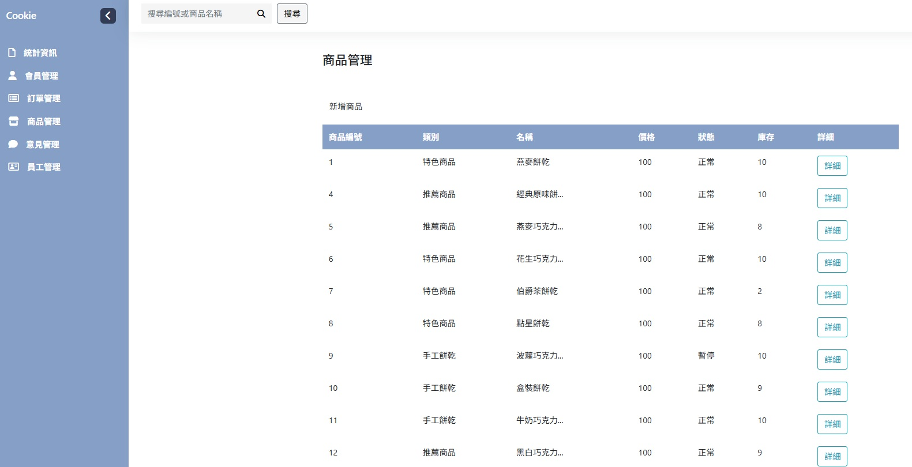

# Annie Cookie

使用 ASP.NET MVC 與 ASP.NET Core MVC 搭配 Web API 製作的手工餅乾購物網站，功能包含會員註冊登入、商品瀏覽與加入購物車、訂單建立及管理，以及後台商品與各類資訊管理、使用者權限管理等功能。

---

## 專案簡介與開發動機
此專案旨在實作具備前後台功能的線上購物平台，作為學習 ASP.NET MVC 與 ASP.NET Core MVC 搭配 Web API 的練習專案。

基於對中小型商家與個人工作室營運狀況的觀察，發現在訂單與會員管理上仍有優化空間。因此本專案透過模擬電商流程，設計一個提升資訊管理效率與使用者體驗的平台。

---

## 專案目標
- 練習 ASP.NET MVC 架構與系統整合
- 使用 ASP.NET Core MVC 搭配 Web API 實作前後端分離架構
- 建立購物網站基本功能與後台管理介面

---

## 我在專案中的角色與貢獻
- 獨立開發專案（架構設計、資料庫設計、前後端功能實作）
- 採三層式架構與前後端分離設計
- 實作會員註冊、訂單流程與後台各類資訊管理、使用者權限管理等功能

---

##  主要功能

###  前台購物網站
- 商品瀏覽與篩選
- 商品加入購物車
- 會員註冊 / 登入 / 變更密碼與資料
- 建立與管理訂單

###  後台管理系統
- 商品、會員、訂單等資料管理（CRUD）
- 使用者權限管理
- 圖表統計（Chart.js）

---

##  使用技術

- 前台開發：ASP.NET MVC (.NET Framework)
- 後台開發：ASP.NET Core MVC + Web API
- 資料庫：MS SQL
- 資料存取：Entity Framework+ LINQ、Entity Framework Core+ LINQ、Dapper、Dapper
- 網頁設計：HTML / CSS / JavaScript / Bootstrap / Vue
- 圖表分析：Chart.js
- 版本控制：GitHub
- 架構設計：三層式架構、前後端分離（Web API）

---

###  使用套件 

- 資料轉換 ：AutoMapper 
- 加密密碼 ：BCrypt.Net 
- 日誌紀錄 ：NLog 

---

##  網站畫面

### 首頁畫面

### 商品列表頁

### 商品詳細資訊頁

### 登入頁面

### 結帳頁面

### 訂單紀錄頁

### 變更密碼頁

### 後台首頁

### 商品管理頁

### 編輯商品畫面

---

##  備註

此專案為「展示程式碼版本」，已省略部分設定，無法直接執行本專案。
